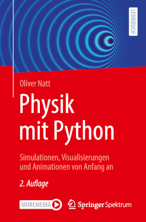

# Physik mit Python

Dieses Repository enthält den Python-Code zu den Programmen und Übungsaufgaben
des Buches.

Oliver Natt  \
**Physik Mit Python**  \
**Simulationen, Visualisierungen und Animationen von Anfang an**  \
2\. Auflage, Springer Spektrum, 2022.

## Weitere Informationen

Neben diesem GitHub-Repository gibt es noch die [Webseite zum
Buch](https://pyph.de/1/2/), auf der neben dem Programmcode auch die fertigen
Animationen aus dem Buch, Erläuterungen zu den Übungsaufgaben und viele weitere
Informationen bereitgestellt werden.
